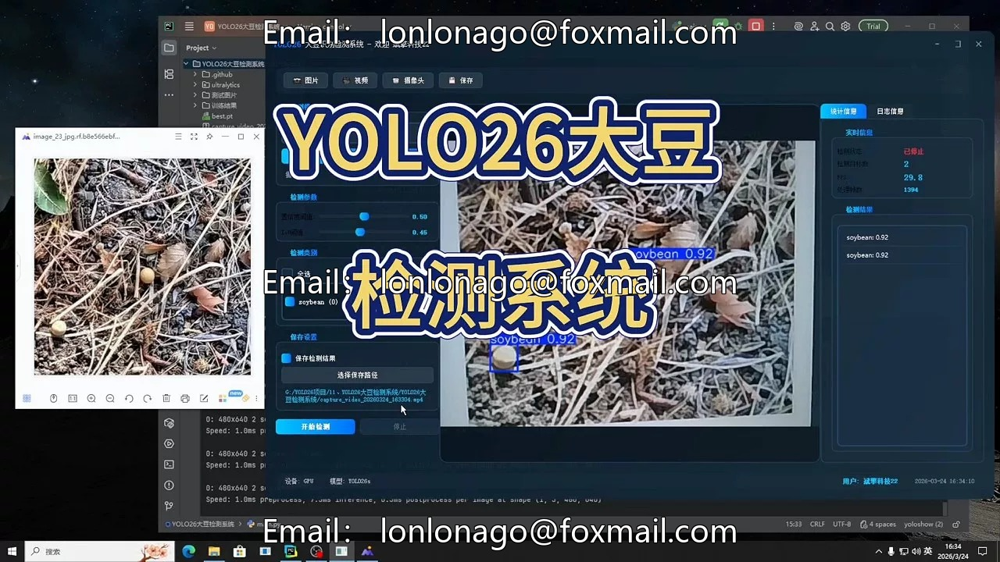
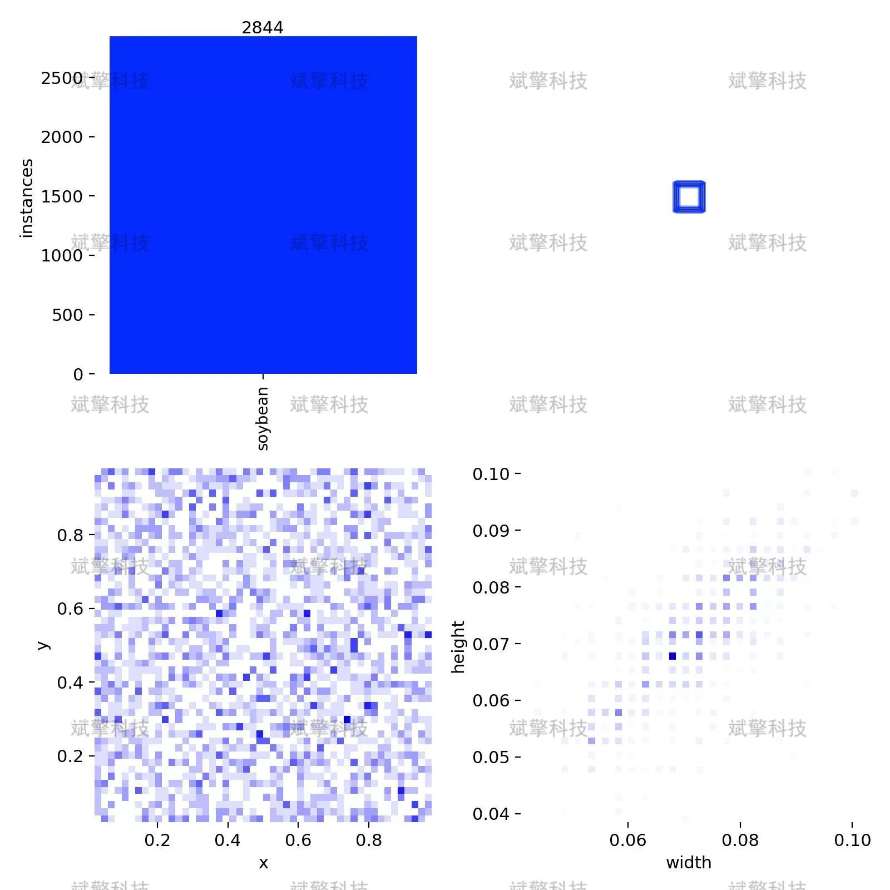
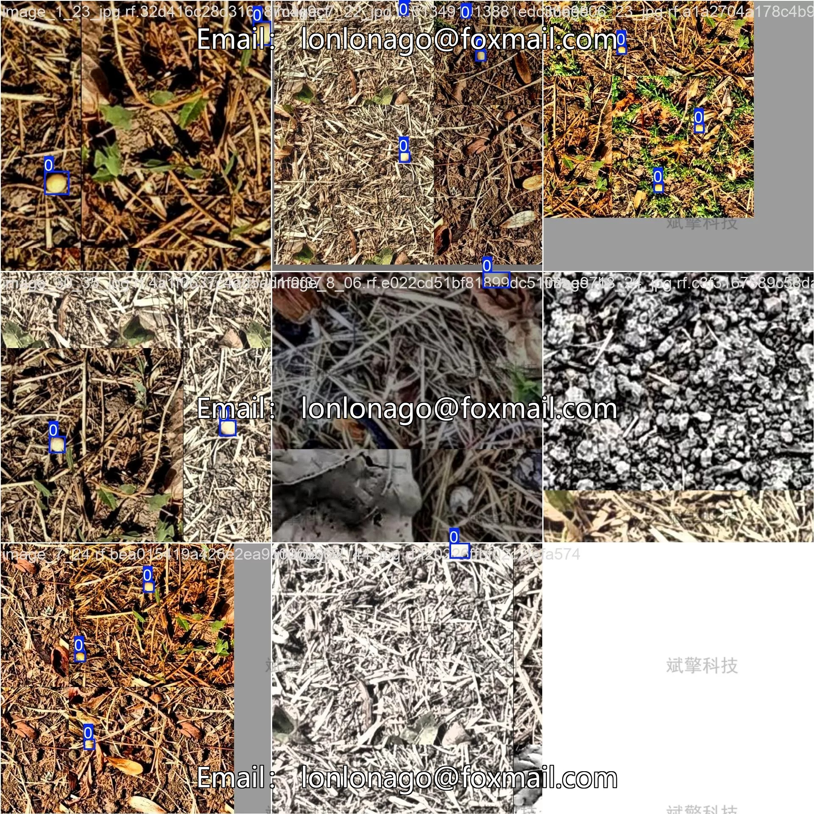
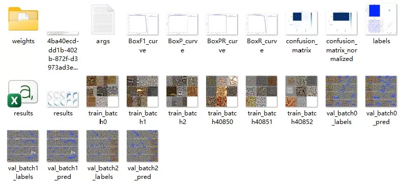
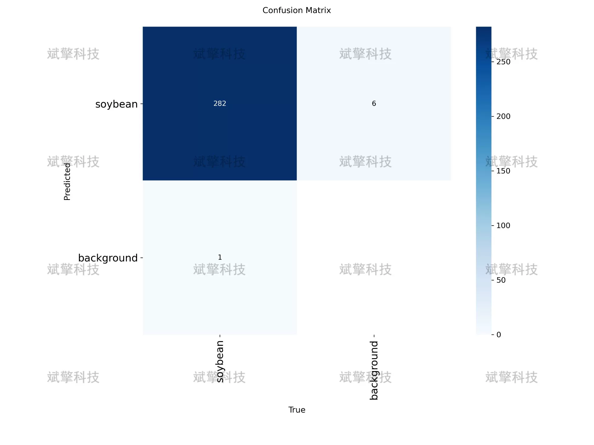
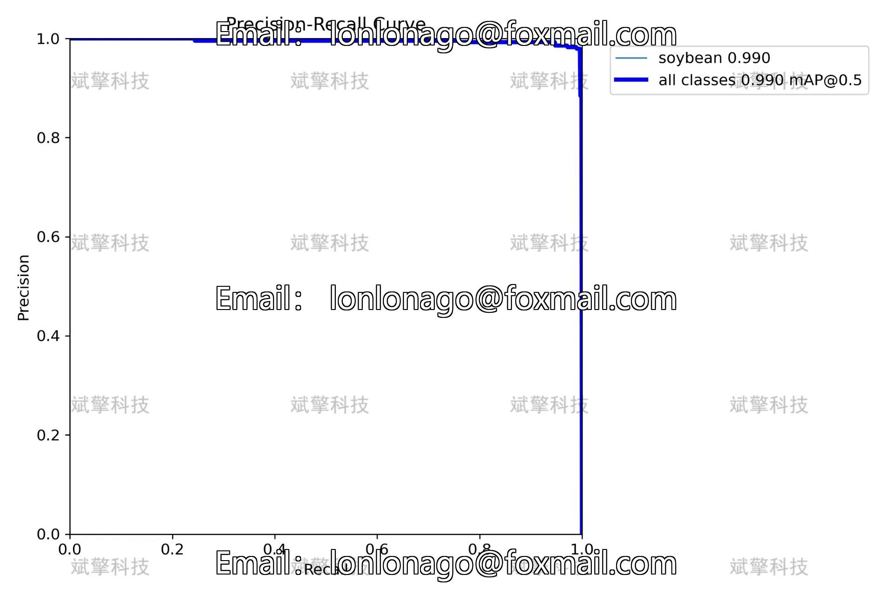
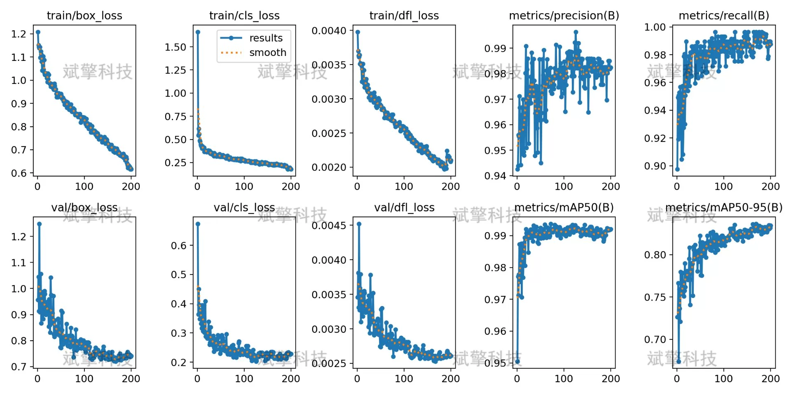
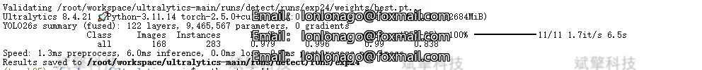
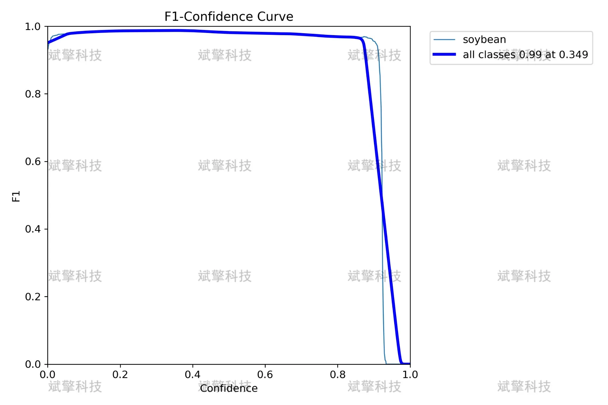

# YOLOv26 Soybean Detection System | Dataset

## Body

YOLO26 Soybean Detection System | Dataset YOLO26 Extreme Performance in Soybean Target Detection: Recall Rate 0.996, Inference Speed 6.0ms/Image

Soybeans, as an important global economic crop, have significant implications for agricultural monitoring, yield estimation, and intelligent harvesting. This paper proposes a soybean target detection system based on YOLO26, aiming to achieve high-precision real-time detection of soybean targets in field environments.
The experimental dataset was built using self-collected images of soybeans, comprising 1984 labeled images, with 1716 training images, 168 validation images, and 100 test images, all marked with the single category "soybean". The model training was conducted using the Ultralytics framework, achieving excellent performance on the validation set through 100 epoch iterations: mAP50 reached 0.996, recall rate 0.996, precision rate 0.979, and mAP50-95 was 0.838. A confusion matrix analysis showed that 282 soybean targets were correctly detected, with only 6 missed and 1 false positive, demonstrating the model's high detection reliability. The training process curve indicated good convergence without overfitting. The detection speed reached 6.0ms/image, meeting the requirements for real-time detection and providing reliable technical support for intelligent agricultural applications.
Number of labeled categories: 1 class
Category name: ['soybean']

Free reservation for remote installation. Unsuccessful refund guaranteed.
Purchase comes with the following resources (auto-unlocked in Baidu Cloud):
   - Complete source code for YOLO recognition projects
   - YOLO format datasets
   - Training code + UI interface code
   - Trained models + results images
   - Software installation package
   - Add WeChat for remote installation (shown automatically after purchase) - Full refund if unsuccessful

⚙️ Core functionality modules
Detection capabilities
    Image detection: upload and detect, returning detection boxes + category information
    Video detection: supports video files, analyzing frames accurately
    Camera real-time detection: connects to USB cameras, enabling dynamic monitoring
Interaction and control
    Target selection: freely choose one or more categories for detection
    Parameter real-time adjustment: adjustable confidence threshold & IoU threshold, flexibly controlling accuracy
    Result saving: one-click save of image/video/camera detection results
System and data
    User login registration: supports password strength checking + encryption storage
    Log recording: automatically records operation and error information (timestamped)

## Images

## Payment

Here is a pay link on Stripe ( https://buy.stripe.com/3cs8yP7sY87d0vu9AB ). Please contact me lonlonago@foxmail.com after funding $89, and I will send you a complete data files , thank you!

